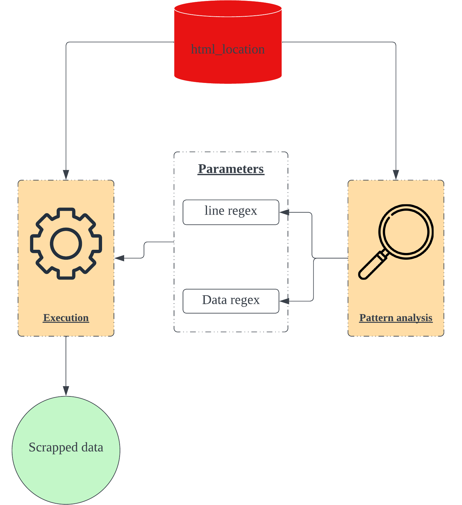

# Basic web scrapping tool

# **Problem**

---

I want to obtain all the various hackathons listed in the webpage. The problem is that there are so many (87 in total). Doing it manually is going to make me pull all my hair out.  

# System visualised

---



Component relations


Concrete view of the steps required to get from html to scrapped data

# Usage Steps

---

1. Download the HTML of the webpage

2. Figure out a pattern around the data of interest    

*e.g. all names are held in a bold tag, and there is only one bold tag in the entire html page.*

3. Input the pattern as a regex into the parameters of the `init.js` file

4. Run the `init.js` file

5. Look at output.txt in output folder to view scrapped data

# Tools

---

- **Execution** → [Input regex](https://www.notion.so/Basic-web-scrapping-tool-3d3703a3e4484aa0a5f8f4b0328e6516?pvs=21) and [run it](https://www.notion.so/Basic-web-scrapping-tool-3d3703a3e4484aa0a5f8f4b0328e6516?pvs=21) to [scrap data from HTML](https://www.notion.so/Basic-web-scrapping-tool-3d3703a3e4484aa0a5f8f4b0328e6516?pvs=21)
- [Pattern analysis](https://www.notion.so/Basic-web-scrapping-tool-3d3703a3e4484aa0a5f8f4b0328e6516?pvs=21) → Identify and construct regex for execution

# Assumptions

---

1. The specified regex represents the columns in a single row of data
    
    ```jsx
    // Every single row has three columns.
    {
    	title: ""
    	link: ""
    	date: ""
    }
    ```
    
2. Every single regex column in a row has a data to it.
    
    ***************No substitute data for those columns with no data in them.*************** 
    
3. You need two different regex to extract the data     
    1. Identify the line
    2. Identify the area within the line
4. The data extracted have no comma in them
5. Pattern and data is all within the same line.